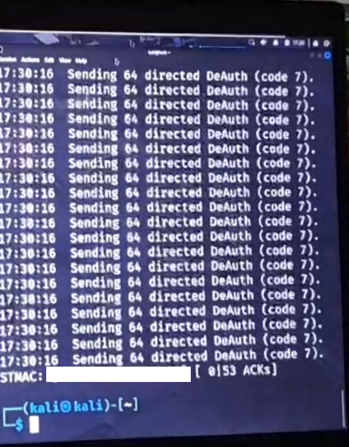
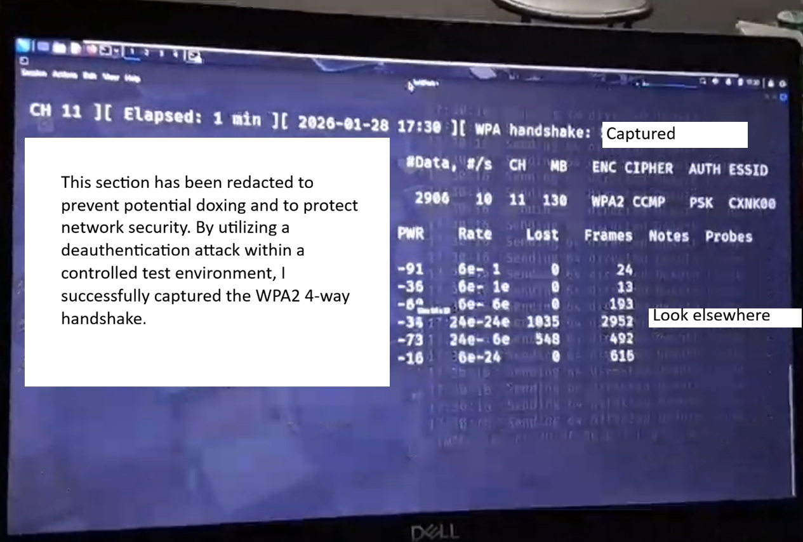

# Colton Lewis Davis

I am a technical investigator driven by a lifelong, obsessive passion for science and the mechanics of the physical world. I don't just "work" with technology; I live it. From the moment I could talk and ask "why" or "how", I’ve been driven to deconstruct how things work. Picture a 5-year-old with a spaghetti-stained mouth, screwdriver in hand, taking apart every household electronic in sight—that drive has never left me. 

My professional foundation is built on 11 years of manufacturing electromechanical devices. I am a builder who thrives in high-stakes, demanding environments. I like to look at the bigger picture and fully understand how systems work. Whether I’m at a lab bench or in the field, I approach every problem with the analytical mindset of a scientist. 

**Core Philosophy:**
I possess a radical drive to understand the underlying systems of our universe; I recognize the same patterns of logic in the predictable chaos of geological systems as I do during complex signal analysis. Whether it is a viral replication cycle in a microorganism or malware, I seek to understand how the system functions at its most fundamental level. For some reason however, after all these years, it seems like I only have more questions. I guess that innate curiosity is really what makes me, me. I hold a deep respect for the uncompromising rigor of pioneers like Marie Curie and Nikola Tesla and am committed to the betterment of mankind through disciplined research.

---

## Self-Directed Technical Research & Lab Work

### 📜🚀 Professional Development
* **CompTIA Security+** (In Progress)
* **FCC Amateur Radio License** (Technician Class - In Progress)

### 🖥️🥼 Virtualization & Lab Architecture
Designed dedicated lab environments using **VMware** and **VirtualBox** to bridge the gap between theory and practice. Includes the custom deployment of specialized **Kali Linux** or **Parrot OS** distributions to study attack/defense scenarios.

### 📶🔐 Wireless Security & Hardware Interfacing
Utilizing specialized Wireless Network Adapters with **monitor mode** and **packet injection** capabilities to perform 802.11 stack analysis.
* [**View Project: WPA2 Handshake Capture & Analysis ↓**](#project-80211-stack-analysis--handshake-capture)

### 📡⚙️ Radio Frequency (RF) Reverse-Engineering
Analyzing sub-GHz consumer devices to decode signals and study **rolling code encryption protocols**. Includes custom antenna design and optimization.
* [**View Project: Mighty Mule RF Security & Optimization ↓**](#project-mighty-mule-rf-security--optimization)

### 📊✈️ Signal Analysis & Aviation Tracking
Operating **Software Defined Radio (SDR)** hardware for signal acquisition. Successfully deployed a local **dump1090** aviation tracking server for real-time ADS-B decoding.

---

# Project: 802.11 Stack Analysis & Handshake Capture

## Phase I: Monitor Mode & Packet Acquisition
**Goal:** Capture EAPOL Handshake frames within a controlled environment to study Layer 2 wireless vulnerabilities.

  
   
  <em>Figure 1: Executing a directed deauthentication attack to trigger a re-association.</em>

**Methodology:**
* Initialized a high-gain NIC into **RFMON (Monitor Mode)** to sniff 802.11 management frames.
* Executed a **Deauthentication Attack** using `aireplay-ng` to force a client re-association, triggering the automatic **4-way handshake**.

  
   
  <em>Figure 2: Successful capture of WPA2 4-way handshake (Redacted for OPSEC)</em>

### Technical Capture Specifications (Aircrack-ng Suite)

| Setting | Value | Rationale |
| :--- | :--- | :--- |
| **Interface Mode** | Monitor (RFMON) | Allows sniffing of raw 802.11 frames without AP association. |
| **Attack Type** | Directed Deauth (Code 7) | Forces a specific Station (Client) to disconnect/reconnect. |
| **Captured Frame** | EAPOL / Handshake | Contains the Nonces/MIC needed for offline crypto-analysis. |
| **Result** | SUCCESS | Handshake acquired on Channel 11. |

## Phase II: Cryptographic Resilience Testing
**Goal:** Verification of password entropy against dictionary-based wordlist attacks.
* **Analysis:** While the handshake was successfully acquired, the network remained secure. 
* **Conclusion:** Due to the implementation of a high-entropy, alphanumeric passphrase without readable dictionary words, offline brute-force attempts were unsuccessful. This reinforces the principle that a strong password policy is the primary defense against WPA2-PSK exploits.

---

# Project: Mighty Mule RF Security & Optimization

## Phase I: Signal Integrity & RSSI Benchmarking
**Goal:** Comparative analysis of legacy vs. new transmitter output to diagnose hardware degradation.

### Technical Capture Specifications (SDR++)

| Setting | Value | Rationale |
| :--- | :--- | :--- |
| **Gain** | 0.0 dB | High-proximity capture; ensures zero LNA clipping for bitstream purity. |
| **AGC** | OFF | Maintains consistent amplitude for data analysis. |
| **Offset Tuning** | ENABLED | Shifts DC spike away from 318 MHz center. |
| **Radio Mode** | AM | Optimal for visualizing/hearing OOK pulse-width. |

<video width="100%" height="auto" controls>
  <source src="assets/videos/MightyMuleV2SignalTest1.mp4" type="video/mp4">
  Your browser does not support the video tag.
</video>

## Phase II: Signal Decoding & Cryptographic Assessment
**Goal:** Bitstream extraction and security audit.
* **Capture:** Utilizing SDR++ and Universal Radio Hacker (URH) to isolate the **OOK (On-Off Keying)** pulse-stream.
* **Objective:** Decoding the bitstream for **Fixed-Code vs. Rolling-Code** analysis to determine susceptibility to Replay Attacks.

## Phase III: Receiver Hardware Optimization
**Goal:** Engineering a custom-tuned **1/4 Wave Monopole** to replace high-loss factory antennas, reducing SWR (Standing Wave Ratio) and improving range.

---

### 🎥 Project Demonstration Status
* **[Analysis: Decoding
