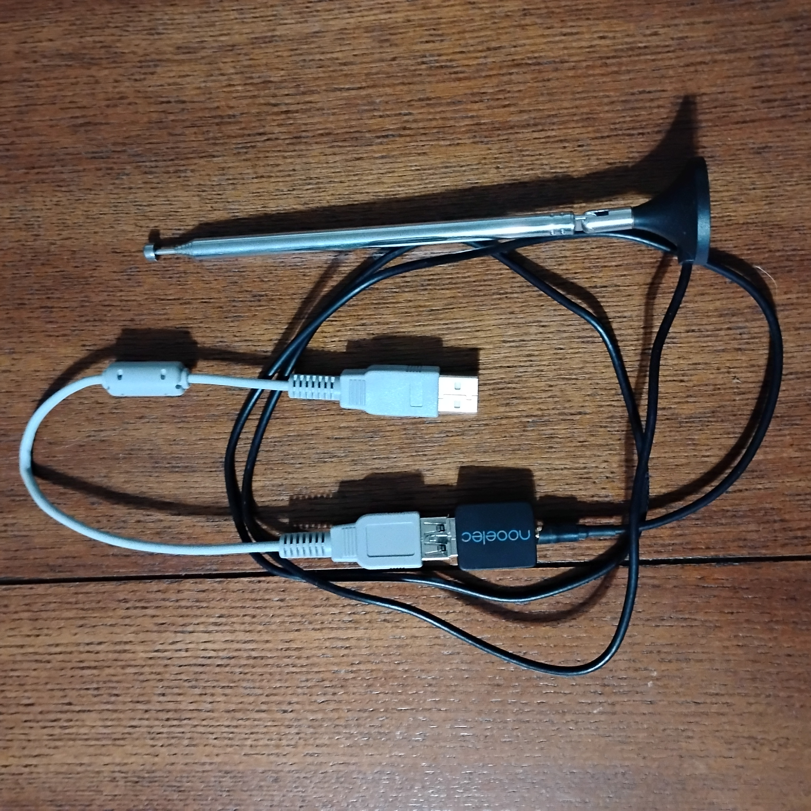
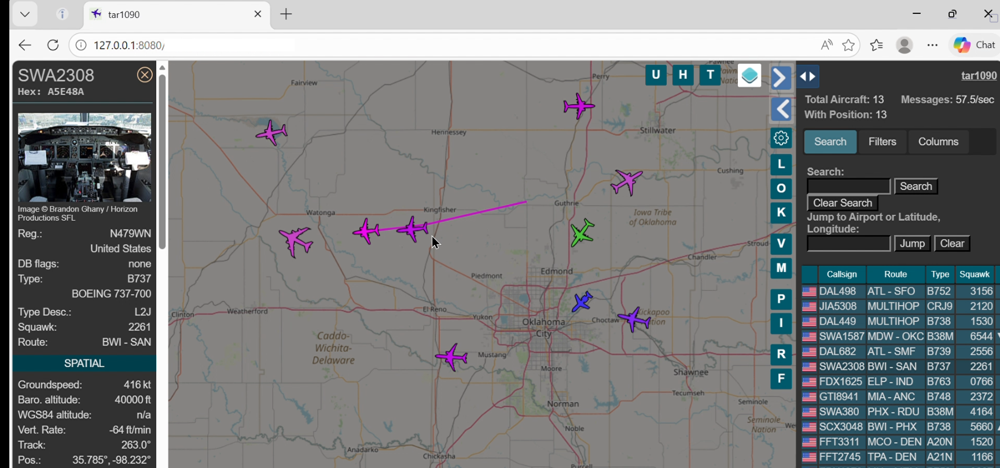
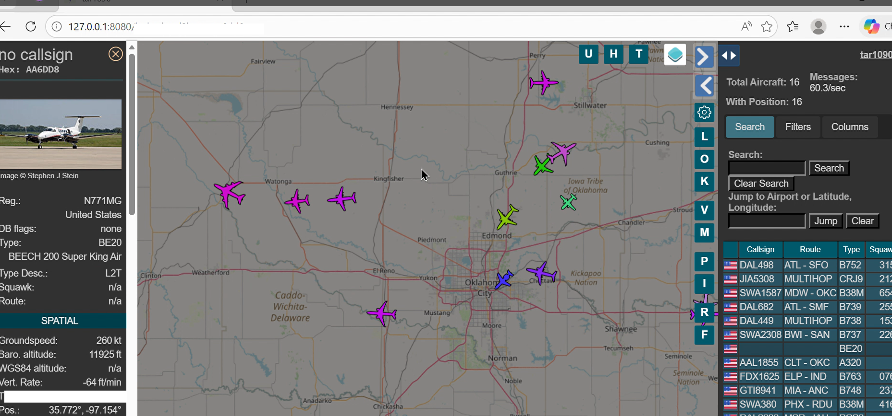

# Project: 1090 MHz ADS-B Ground Station Deployment

## Phase I: RF Signal Acquisition & Mode-S Decoding
**Goal:** Capture and decode Automatic Dependent Surveillance–Broadcast (ADS-B) signals to visualize real-time airspace data.

  
   
  <em>Figure 3: Initializing the RTL-SDR for wideband signal acquisition at 1090 MHz.</em>

### Technical Theory: How 1090 MHz ADS-B Works
* **The Pulse:** Aircraft equipped with Mode-S transponders broadcast data bursts at **1090 MHz**. These signals utilize Pulse Position Modulation (PPM) to transmit digital packets containing the aircraft's ICAO address, altitude, and GPS coordinates.
* **The Acquisition:** Using an **RTL-SDR** with a 1090 MHz tuned antenna, the raw RF energy is down-converted and sampled into digital I/Q data.
* **The Decoding:** The **dump1090** tool processes these samples, performing checksum verification and bitstream extraction to turn "noise" into structured hexadecimal data.

## Phase II: Local Server Architecture & Data Visualization
**Goal:** Bridge the decoded bitstream to a browser-based visualization tool via a local web server.

  
   
  <em>Figure 4: Localized ground station interface hosted on 127.0.0.1 (Loopback).</em>

  
   
  <em>Figure 5: Decoded aircraft telemetry. Lat/Lon and Distance data sanitized for OPSEC.</em>

**System Integration:**
* **Data Flow:** The decoded data is pushed to a local web server (**tar1090**) which compiles the telemetry into a real-time JSON feed.
* **The Loopback Environment:** By hosting the dashboard on **127.0.0.1:8080**, the data remains strictly within the local lab environment. This proves the ability to manage a full-stack SIGINT pipeline—from the physical antenna to a functional browser-based UI—without relying on third-party internet services.
* **OPSEC Protocol:** To demonstrate technical responsibility, high-risk metadata (Signal Strength and precise Receiver Coordinates) has been redacted from the public documentation to prevent ground station triangulation.
